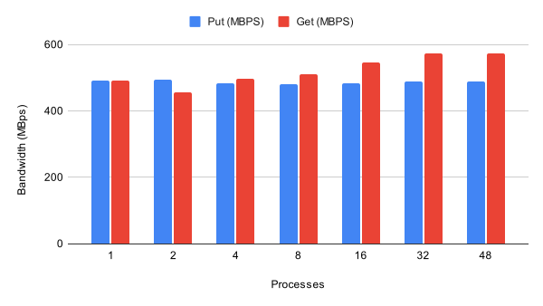
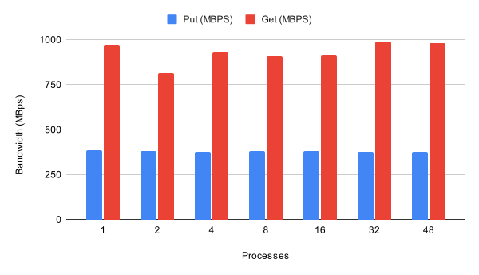
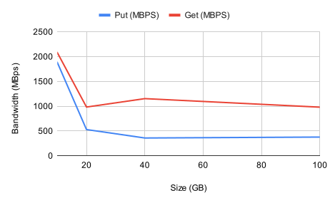
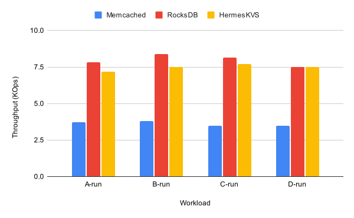
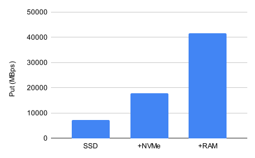
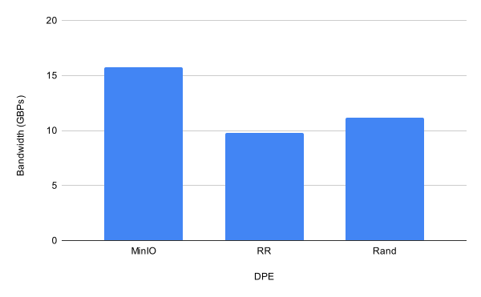

The following experiments were conducted on the Ares cluster at IIT.
The scripts for these experiments are located
[here](https://github.com/lukemartinlogan/hermes_scripts/blob/master/).

# 2.00. Experimental Setup
Ares has 32x compute nodes. Each compute node has two
2.2GHz Xeon Scalable Silver 4114 CPUs, totaling 48 cores per node. Each node
is additionally equipped with 40GB of DDR4-2600MHz RAM, a 250GB NVMe,
and a 480GB SATA SSD.

We use the following Hermes configurations in the below experiments:
1. SSD: The baseline configuration contains only a SATA SSD, which has the least
performance. Up to 400GB capacity.
2. +NVMe: Add an NVMe of 150GB.
3. +RAM: Add main memory of 20GB.

# 2.01. Device Benchmark

In this experiment, we benchmark each storage device on compute nodes
individually using IOR and a custom sequential memory benchmark tool.
We vary the number of threads and dataset sizes. The objective of this
experiment is to understand the characteristics of the testbed's hardware.
This evaluation was conducted only over a single node.

## 2.1.1. SSD

### Strong scaling
First we perform a strong scaling study.
1. Total dataset size fixed at 100GB
2. Processes vary between 1 and 48
3. Transfer size of 1MB

|  |
|:--:|
|SSD strong scaling|

Overall, we find that the SSD's performance doesn't change much with
increase in number of processes. The performance difference between
1 process and 48 processes is roughly 15% for Get, and negligible for Put.

### Dataset Size
Next we measure the impact of dataset size on performance. This is because
we want to measure the impact of garbage collection and OS caching.
1. Total dataset size varies from 10GB to 100GB
2. Processes fixed at 4
3. Transfer size of 1MB

|  |
|:--:|
|SSD dataset size scaling|

Here we see that the total dataset size does have impacts on performance,
and it's not all due to caching. For datasets of size 10GB, performance
of the SSD is roughly 1.3GBps for Get and 650MBps for Put. After 40GB
dataset size, the performance stagnates at 510MBps for both Put and Get.

## 2.1.2. NVMe

### Strong scaling
First we perform a strong scaling study.
1. Total dataset size fixed at 100GB
2. Processes vary between 1 and 48
3. Transfer size of 1MB

|  |
|:--:|
|NVMe strong scaling|

Overall, we find that the NVMe's performance doesn't change much with
increase in number of processes. Unlike SATA SSD, the NVMe had no
difference as number of processes increased.

### Dataset Size
Next we measure the impact of dataset size on performance. This is because
we want to measure the impact of garbage collection and OS caching.
1. Total dataset size varies from 10GB to 100GB
2. Processes fixed at 4
3. Transfer size of 1MB

|  |
|:--:|
|NVMe dataset size scaling|

The dataset size had a dramatic change in performance with dataset size.
This also is not (entirely) due to caching. For 10GB dataset sizes,
the NVMe reaches nearly 2GBps for both Put and Get. For datasets larger
than 20GB, NVMe performance stagnates at roughly 390MBPs for Put and
1.1GBps for Get.

### 2.1.3. RAM

TODO. Place results here.

# 2.02. Multi-Core I/O Scaling

In this experiment, we measure the effect of multi-core scaling on the
performance of the NVMe configuration of Hermes. We vary the number of
processes to be between 1 and 48. Each case performs a total of 100GB of
I/O with transfer sizes of 1MB using the Hermes native Put/Get API.
This evaluation was conducted only over a single node.

|  |
|:--:|
|NVMe dataset size scaling|

For NVMe, the performance of both PUT and GET operations were nearly the
same in performance as the evaluation conducted in 1.1. Hermes adds minimal
overhead when scaling the number of CPU cores.

# 2.03. Yahoo Cloud Storage Benchmark (YCSB)

In this experiment, we compare Hermes as a single-node key-value store
against other popular key-value stores. For this, we use the Yahoo
Cloud Storage Benchmark (YCSB). The YCSB comes with 8 workloads.
We focus on the first 4:
1. Workload A (Update-heavy): This workload generates a high number of update
requests compared to reads. It represents applications where data is updated
more frequently than it is read.
2. Workload B (Read-heavy): This workload generates a high number of read
requests compared to updates. It represents applications where data is read more
frequently than it is updated.
3. Workload C (Read-only): This workload generates only read requests. It
represents applications where data is read frequently but is never updated.
4. Workload D (Read-modify-write): This workload generates read, modify, and
write requests in equal proportions. It represents applications where data is
updated based on its current value.

In addition, each workload contains a "Load" phase which perform insert-only
workloads. Unlike an update, insert replaces the entire record.

|  |
|:--:|
|Performance of KVS for the LOAD phase of YCSB|

In this workload, HermesKVS performs roughly 33% better on average than
all alternative KVS. This workload is particularly good for the Hermes
KVS adapter, since insert operations replace data. In our KVS, a record
(a tuple of values) is stored as a single blob. This translates almost
directly to a single Put operation in the Hermes KVS. This demonstrates
that Hermes can perform comparably to well-established in-memory KVS.

|  |
|:--:|
|Performance of KVS for the RUN phase of YCSB|

In these workloads, HermesKVS performs comparably to RocksDB and significantly
faster than memcached.

RocksDB performs 15% faster than HermesKVS for the
update-heavy workload. This is because, as opposed to a log-structured merge
tree provided in RocksDB, HermesKVS relies on locking + modifying entries
directly. This is more costly, as HermesKVS must retrieve data and then
modify the data, as opposed to just transferring the updates.

# 2.04. Multi-Tier I/O performance

In this evaluation, we run a multi-tiered experiment using Hermes native
API. The workload sequentially PUTs 10GB per-node. We ran this experiment
with 16 nodes and 16 processes per node. The overall dataset size is 160GB.

|  |
|:--:|
|Performance of Hermes for varying Tiers|

Overall, we see that with the addition of each tier, performance improvements
are observed. A 2.5x performance improvement is observed by adding NVMe.
An additional 2.5x performance improvement is observed by adding RAM. In
this case, the dataset fits entirely within a single tier, achieving nearly the
full bandwidth of that tier in this specific case.

# 2.05. DPE Comparison

Hermes comes with three Data Placement Engines (DPEs):
1. Round-Robin: Iterates over the set of targets fairly, dispersing blobs
evenly among the targets.
2. Random: Choose a target to buffer a blob at random.
3. Minimize I/O Time: place data in the fastest tier with space remaining.
Asynchronously flush data later.

To demonstrate the value of customized buffering, we focus on a high-bandwidth
synthetic workload. Each rank produces a total of 1GB of data, there are 16
ranks per node, and a total of 4 nodes. The total dataset size produced is
160GB. We use a hierarchical setup with RAM, NVMe, and SATA SSD.

|  |
|:--:|
|Performance of Hermes for varying DPEs|

Overall, we find that the choice of DPE has significant impact on overall
performance. The Minimize I/O Time DPE performs roughly 40% better than
Round Robin and 34% better than Random. This is because Round Robin and
Random disperse I/O requests among each storage device roughly evenly,
whereas Minimize I/O Time places data in the fastest available tiers.

# 2.06. Data Staging Benefit

Data staging can be used to load full or partial datasets in to the hiearchy
before the application begins. For applications which iterate over datasets
multiple times, staging can provide great performance benefits.

To demonstrate the value of data staging, we use ior. The workload is
structured as follows:
1. 4 nodes, 16 processes per node
2. Generate a 256GB dataset using IOR
3. Stage in the 256GB dataset in Hermes
4. Run IOR read workload

Hermes is configured as follows:
| Key | Parameter |
|:--:|:--:|
| RAM | 16GB (per node) |
| NVMe | 100GB (per node) |
| SSD | 150GB (per node) |

We compare the performance of using staging to without using staging. The
results are shown in the figure below.

|  |
|:--:|
|Performance of Staging|

In this case, 25% of the dataset is staged in RAM and 75% of the dataset
is staged in NVMe. Without staging, Hermes incurs the cost of reading data
from the PFS in addition to placing data into Hermes. In this case, the
performance benefit of staging as compared to no staging is roughly 4x.

# 2.07. Prefetching Benefit

TODO. Place results here.

# 2.08. Grey-Scott Model

The Grey-Scott Model is a 3D 7-point stencil code for modeling reaction
diffusion. The model contains the following parameters

| Key | Parameter |
|:--:|:--:|
| L | This size of the global array (An L x L x L cube) |
| steps | Total number of steps |
| plotgap | Number of steps between output |
| Du | Diffusion coefficient of U in the mathematical model |
| Dv | Diffusion coefficient of V in the mathematical model |
| F | Feed rate of U |
| k | Kill rate of V |
| dt | Timestep |
| noise | Amount of noise to inject |
| output | Where to output data to |
| adios_config | The ADIOS2 XML file |

In our case, we use the following configuration:
| Key | Parameter |
|:--:|:--:|
| L | 128 |
| steps | 200,000 |
| plotgap | 16 |

# 2.10. Metadata Performance

## 2.10.1. Create Bucket

TODO. Place the results here.

### Single-Node

TODO. Place the results here.

## 2.10.2. Get Bucket

TODO. Place the results here.

## 2.10.3. Create Blob

TODO. Place the results here.

## 2.10.4. Destroy Blob

TODO. Place the results here.

## 2.10.5. Destroy Bucket

TODO. Place the results here.

# 2.11. Other Use Cases

### Benchmarks

- [HPC IO Benchmark Repository](https://github.com/hpc/ior)
- [VPIC](https://github.com/lanl/vpic)
- [DLIO Benchmark](https://github.com/hariharan-devarajan/dlio_benchmark)

### By Hand I/O Buffering

  - [Simulation and visualization of thunderstorms, tornadoes, and
    downbursts](http://orf.media/)
  - [LOFS: A simple file system for massively parallel cloud
    models](https://www.youtube.com/watch?v=bD-9lK2pvqA&list=PLPyhR4PdEeGYzF3rx1KZDDOxitBDSnGes&index=3)

### References

[CORAL-2 Benchmarks](https://asc.llnl.gov/coral-2-benchmarks/)

# 2.12. Note on Performance

Hermes is not currently optimized for small I/O workloads -- especially
for the filesystem adapters. We are working on removing some of the locks and 
adding metadata caching.
